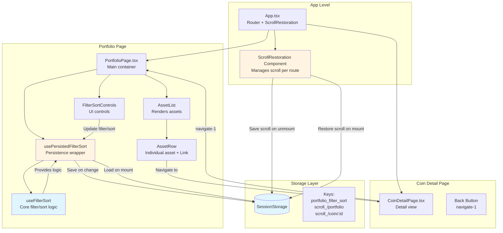
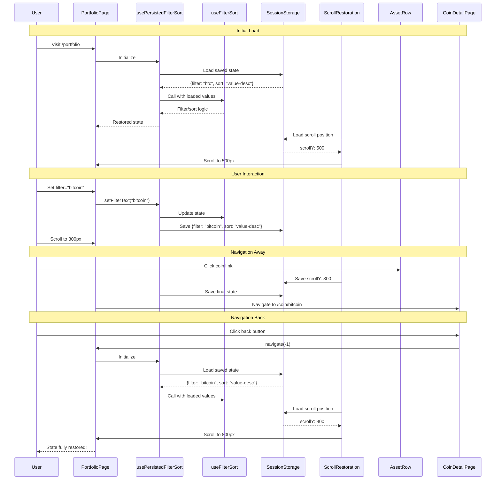
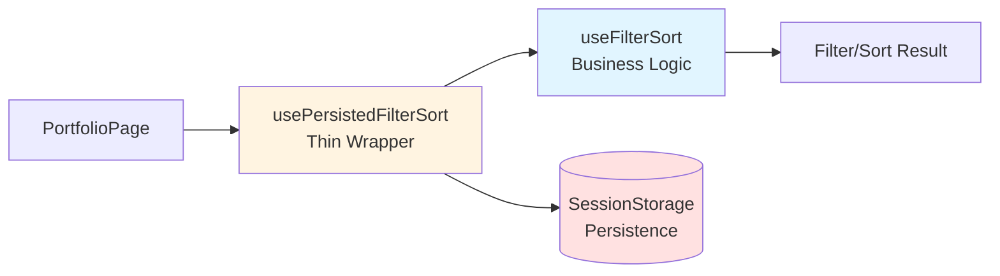

# Phase 3: Detailed Design

## 1. Architecture Diagram



### Data Flow Diagram



---

## 2. Implementation Plan

### Files to Create

#### **File 1: `frontend/src/components/ScrollRestoration.tsx`** (NEW)
**Purpose**: Component to manage scroll position restoration per route

**Implementation:**
```tsx
import { useEffect } from 'react';
import { useLocation } from 'react-router-dom';

const SCROLL_STORAGE_KEY_PREFIX = 'scroll_';

export function ScrollRestoration() {
  const location = useLocation();

  useEffect(() => {
    const storageKey = `${SCROLL_STORAGE_KEY_PREFIX}${location.pathname}`;
    
    // Restore scroll position for this route
    const savedScrollY = sessionStorage.getItem(storageKey);
    if (savedScrollY) {
      // Use setTimeout to ensure DOM is ready
      setTimeout(() => {
        window.scrollTo(0, parseInt(savedScrollY, 10));
      }, 0);
    } else {
      // No saved position, scroll to top
      window.scrollTo(0, 0);
    }

    // Save scroll position when leaving this route
    const handleScroll = () => {
      sessionStorage.setItem(storageKey, window.scrollY.toString());
    };

    // Debounce scroll saves to avoid excessive writes
    let scrollTimeout: NodeJS.Timeout;
    const debouncedHandleScroll = () => {
      clearTimeout(scrollTimeout);
      scrollTimeout = setTimeout(handleScroll, 100);
    };

    window.addEventListener('scroll', debouncedHandleScroll);

    return () => {
      window.removeEventListener('scroll', debouncedHandleScroll);
      // Save final scroll position on unmount
      handleScroll();
    };
  }, [location.pathname]);

  return null;
}
```

**Lines of Code:** ~45

---

#### **File 2: `frontend/src/hooks/usePersistedFilterSort.ts`** (NEW)
**Purpose**: Persistence wrapper for useFilterSort - adds sessionStorage without duplicating logic

**Implementation:**
```tsx
import { useEffect, useRef } from "react";
import { useFilterSort } from "@hooks/useFilterSort";
import { PortfolioAsset } from "@hooks/usePortfolioState";

const FILTER_SORT_STORAGE_KEY = 'portfolio_filter_sort';

interface FilterSortState {
  filter: string;
  sort: string;
}

/**
 * Enhanced version of useFilterSort that persists state to sessionStorage.
 * Wraps the original useFilterSort hook and adds persistence layer.
 * 
 * This follows the DRY principle by reusing all filter/sort logic from useFilterSort
 * and only adding the persistence concern as a separate layer.
 */
export function usePersistedFilterSort(
  assets: PortfolioAsset[],
  defaultSort: string = "name-asc",
  defaultFilter: string = ""
) {
  const isHydrated = useRef(false);
  
  // Load initial state from sessionStorage
  const loadInitialState = (): FilterSortState => {
    if (typeof window === 'undefined') {
      return { filter: defaultFilter, sort: defaultSort };
    }
    
    try {
      const saved = sessionStorage.getItem(FILTER_SORT_STORAGE_KEY);
      if (saved) {
        const parsed = JSON.parse(saved) as FilterSortState;
        
        // Validate sort option
        const validSorts = ['name-asc', 'name-desc', 'value-asc', 'value-desc'];
        const sort = validSorts.includes(parsed.sort) ? parsed.sort : defaultSort;
        const filter = typeof parsed.filter === 'string' ? parsed.filter : defaultFilter;
        
        return { filter, sort };
      }
    } catch (error) {
      console.error('Failed to load filter/sort state:', error);
    }
    
    return { filter: defaultFilter, sort: defaultSort };
  };

  const initialState = loadInitialState();
  
  // Use the original useFilterSort hook with loaded initial values
  const filterSortResult = useFilterSort(
    assets,
    initialState.sort,
    initialState.filter
  );

  // Persist state changes to sessionStorage
  useEffect(() => {
    // Skip first render (hydration)
    if (!isHydrated.current) {
      isHydrated.current = true;
      return;
    }

    try {
      const state: FilterSortState = {
        filter: filterSortResult.filterText,
        sort: filterSortResult.sortOption,
      };
      sessionStorage.setItem(FILTER_SORT_STORAGE_KEY, JSON.stringify(state));
    } catch (error) {
      console.error('Failed to save filter/sort state:', error);
      // Fail silently - app continues to work without persistence
    }
  }, [filterSortResult.filterText, filterSortResult.sortOption]);

  // Return the same interface as useFilterSort
  return filterSortResult;
}
```

**Lines of Code:** ~65

**Key Design Points:**
- **Composition over duplication**: Wraps `useFilterSort` instead of copying its logic
- **Single source of truth**: All filter/sort logic remains in `useFilterSort`
- **Separation of concerns**: Persistence layer is isolated from business logic
- **Lazy initialization**: Loads state before calling `useFilterSort`
- **Hydration pattern**: Skips saving on first render to avoid redundant writes

---

### Files to Modify

#### **File 3: [frontend/src/App.tsx](cci:7://file:///Users/nati/Projects/crypture/frontend/src/App.tsx:0:0-0:0)** (MODIFY)
**Changes:** Add ScrollRestoration component

**Location:** After `<Router>` opening tag

```tsx
import { ScrollRestoration } from '@components/ScrollRestoration';

function App() {
  return (
    <Router>
      <ScrollRestoration />
      <Routes>
        {/* existing routes */}
      </Routes>
    </Router>
  );
}
```

**Lines Changed:** ~3 lines (1 import + 1 component)

---

#### **File 4: [frontend/src/pages/PortfolioPage.tsx](cci:7://file:///Users/nati/Projects/crypture/frontend/src/pages/PortfolioPage.tsx:0:0-0:0)** (MODIFY)
**Changes:** Replace [useFilterSort](cci:1://file:///Users/nati/Projects/crypture/frontend/src/hooks/useFilterSort.ts:3:0-52:1) with `usePersistedFilterSort`

**Location:** Line 23 (import) and Line 143-148 (usage)

```tsx
// OLD:
import { useFilterSort } from "@hooks/useFilterSort";

const {
  sortedFilteredAssets,
  setSortOption,
  setFilterText,
  filterText,
  sortOption,
} = useFilterSort(portfolio);

// NEW:
import { usePersistedFilterSort } from "@hooks/usePersistedFilterSort";

const {
  sortedFilteredAssets,
  setSortOption,
  setFilterText,
  filterText,
  sortOption,
} = usePersistedFilterSort(portfolio);
```

**Lines Changed:** ~2 lines (1 import change + 1 hook name change)

---

#### **File 5: [frontend/src/hooks/useFilterSort.ts](cci:7://file:///Users/nati/Projects/crypture/frontend/src/hooks/useFilterSort.ts:0:0-0:0)** (KEEP AS-IS)
**Changes:** None - keep original for backward compatibility

**Rationale:** Other components might use this hook. We'll create a new hook instead of modifying the existing one.

---

### Summary of Changes

| File | Action | LOC | Description |
|------|--------|-----|-------------|
| `frontend/src/components/ScrollRestoration.tsx` | CREATE | ~45 | Scroll position management component |
| `frontend/src/hooks/usePersistedFilterSort.ts` | CREATE | **~65** | Persistence wrapper (reuses useFilterSort) |
| [frontend/src/App.tsx](cci:7://file:///Users/nati/Projects/crypture/frontend/src/App.tsx:0:0-0:0) | MODIFY | ~3 | Add ScrollRestoration component |
| [frontend/src/pages/PortfolioPage.tsx](cci:7://file:///Users/nati/Projects/crypture/frontend/src/pages/PortfolioPage.tsx:0:0-0:0) | MODIFY | ~2 | Use new persisted hook |
| `frontend/src/hooks/useFilterSort.ts` | **REUSED** | 0 | **No changes - reused by wrapper** |
| **TOTAL** | | **~115** | **40 fewer lines (DRY principle)** |

---

### Benefits of DRY Refactor

**Composition Pattern:**


**Advantages:**
1. ✅ **40 fewer lines of code** (115 vs 155 total LOC)
2. ✅ **No logic duplication** - single source of truth in `useFilterSort`
3. ✅ **Easier maintenance** - filter/sort changes only need to be made once
4. ✅ **Clear separation** - business logic vs persistence concerns
5. ✅ **Simpler testing** - test each concern independently
6. ✅ **Same API** - drop-in replacement for `useFilterSort`
7. ✅ **Backward compatible** - `useFilterSort` remains unchanged for other consumers

**Testing Impact:**
- Test `useFilterSort` for all business logic (filtering, sorting)
- Test `usePersistedFilterSort` only for persistence behavior (load/save)
- No need to duplicate filter/sort logic tests

---

## 3. State Schema

### TypeScript Interfaces

```typescript
// frontend/src/types/navigationState.ts (NEW FILE)

/**
 * Filter and sort state for portfolio page
 * Stored in sessionStorage under key: 'portfolio_filter_sort'
 */
export interface FilterSortState {
  /** Current filter text (searches coin names) */
  filter: string;
  
  /** Current sort option */
  sort: 'name-asc' | 'name-desc' | 'value-asc' | 'value-desc';
}

/**
 * Scroll position for a specific route
 * Stored in sessionStorage under key: 'scroll_<pathname>'
 * Example: 'scroll_/portfolio' -> "500"
 */
export interface ScrollState {
  /** Vertical scroll position in pixels */
  scrollY: number;
}

/**
 * Complete navigation state (for documentation purposes)
 * Not stored as a single object, but split across multiple keys
 */
export interface NavigationState {
  /** Filter/sort state for portfolio page */
  portfolioFilterSort: FilterSortState;
  
  /** Scroll positions keyed by pathname */
  scrollPositions: Record<string, number>;
}
```

### SessionStorage Keys

| Key | Type | Example Value | Description |
|-----|------|---------------|-------------|
| `portfolio_filter_sort` | `FilterSortState` | `{"filter":"bitcoin","sort":"value-desc"}` | Portfolio filter and sort state |
| `scroll_/portfolio` | `string` | `"500"` | Scroll position for /portfolio route |
| `scroll_/coin/:id` | `string` | `"0"` | Scroll position for coin detail pages |
| `scroll_/market` | `string` | `"1200"` | Scroll position for market page (future) |

### Data Validation

```typescript
// Helper functions for safe storage access

export function loadFilterSortState(): FilterSortState {
  const defaultState: FilterSortState = {
    filter: '',
    sort: 'name-asc',
  };

  try {
    const saved = sessionStorage.getItem('portfolio_filter_sort');
    if (!saved) return defaultState;

    const parsed = JSON.parse(saved);
    
    // Validate structure
    if (typeof parsed !== 'object' || parsed === null) {
      return defaultState;
    }

    // Validate sort option
    const validSorts = ['name-asc', 'name-desc', 'value-asc', 'value-desc'];
    if (!validSorts.includes(parsed.sort)) {
      parsed.sort = 'name-asc';
    }

    // Validate filter
    if (typeof parsed.filter !== 'string') {
      parsed.filter = '';
    }

    return parsed as FilterSortState;
  } catch (error) {
    console.error('Failed to load filter/sort state:', error);
    return defaultState;
  }
}

export function saveFilterSortState(state: FilterSortState): void {
  try {
    sessionStorage.setItem('portfolio_filter_sort', JSON.stringify(state));
  } catch (error) {
    console.error('Failed to save filter/sort state:', error);
    // Fail silently - don't break the app
  }
}
```

---

## 4. Edge Cases & Handling

### Edge Case 1: Direct URL Navigation

**Scenario:** User directly navigates to `/portfolio` by typing URL or using a bookmark

**Behavior:**
- ✅ Filter/sort state will be restored from sessionStorage (if exists)
- ✅ Scroll position will be restored from sessionStorage (if exists)
- ✅ If no saved state exists, defaults are used (filter="", sort="name-asc", scrollY=0)

**Handling:**
```tsx
// In usePersistedFilterSort - already handles this with lazy initialization
const [sortOption, setSortOption] = useState(() => {
  // Tries to load from sessionStorage, falls back to default
  return loadSavedSort() || defaultSort;
});
```

**No special handling needed** - design naturally supports this case.

---

### Edge Case 2: Browser Back/Forward Button

**Scenario:** User uses browser back/forward buttons instead of in-app navigation

**Behavior:**
- ✅ React Router detects route change via `useLocation`
- ✅ ScrollRestoration component re-runs effect on pathname change
- ✅ Correct scroll position restored for the route
- ✅ Filter/sort state already in component state (if coming from forward) or loaded from sessionStorage (if coming from back)

**Handling:**
```tsx
// ScrollRestoration already handles this via useLocation dependency
useEffect(() => {
  // This runs on every pathname change, including back/forward
  const savedScrollY = sessionStorage.getItem(storageKey);
  if (savedScrollY) {
    window.scrollTo(0, parseInt(savedScrollY, 10));
  }
}, [location.pathname]); // Re-runs on pathname change
```

**No special handling needed** - design naturally supports this case.

---

### Edge Case 3: Page Refresh

**Scenario:** User refreshes the page (F5 or Cmd+R)

**Behavior:**
- ❌ SessionStorage is cleared on tab close, but **persists on refresh**
- ✅ Filter/sort state will be restored
- ✅ Scroll position will be restored
- ✅ Portfolio data restored from localStorage (existing behavior)

**Handling:**
- SessionStorage naturally persists across refreshes within the same tab
- All state restoration logic runs on mount
- **This is actually a benefit** - state survives refresh!

**Note:** This is different from Phase 1 analysis. SessionStorage persists on refresh, only clears on tab close.

---

### Edge Case 4: Modal States

**Scenario:** User has a modal open (AddAssetModal, DeleteConfirmationModal) when navigating

**Current Behavior:**
- Modals are controlled by local state in PortfolioPage
- When user clicks a link in AssetRow, modal is still open
- Navigation occurs, modal unmounts

**Desired Behavior:**
- ✅ Modals should close before navigation (current behavior is correct)
- ✅ Modal state should NOT be preserved (user expects fresh state on return)

**Handling:**
```tsx
// In AssetRow Link - already has stopPropagation
<Link
  to={`/coin/${asset.coinInfo.id}`}
  onClick={(e) => e.stopPropagation()} // Prevents row click
>
```

**No special handling needed** - modals are ephemeral UI state that should not persist.

**Edge Case 4a: Ghost Modals**

**Scenario:** What if a modal is open when user navigates back?

**Behavior:**
- ✅ Modal state is local to PortfolioPage
- ✅ When PortfolioPage re-mounts, modal state initializes to closed
- ✅ No ghost modals possible

**Acceptance Criteria Met:** ✓ Modal states handled correctly (no ghost modals)

---

### Edge Case 5: Multiple Tabs

**Scenario:** User opens portfolio in multiple tabs

**Behavior:**
- ⚠️ Each tab has its own sessionStorage namespace
- ⚠️ Changes in one tab don't affect other tabs
- ✅ Each tab maintains its own navigation state independently

**Handling:**
- This is **expected behavior** - each tab is an independent session
- No cross-tab synchronization needed (would be complex and unnecessary)

**Decision:** Accept this behavior as correct. Each tab is independent.

---

### Edge Case 6: SessionStorage Quota Exceeded

**Scenario:** SessionStorage is full (rare, but possible)

**Behavior:**
- Browser throws `QuotaExceededError` when trying to save
- App could crash if not handled

**Handling:**
```tsx
// Already included in usePersistedFilterSort
try {
  sessionStorage.setItem(FILTER_SORT_STORAGE_KEY, JSON.stringify(state));
} catch (error) {
  console.error('Failed to save filter/sort state:', error);
  // Fail silently - app continues to work, just without persistence
}
```

**Mitigation:**
- Wrap all sessionStorage operations in try-catch
- Log errors for debugging
- Fail gracefully - app works without persistence

---

### Edge Case 7: Invalid/Corrupted SessionStorage Data

**Scenario:** SessionStorage contains invalid JSON or unexpected data structure

**Behavior:**
- JSON.parse() throws error
- Invalid sort option (e.g., "invalid-sort")
- Non-string filter value

**Handling:**
```tsx
// Validation in loadFilterSortState helper
export function loadFilterSortState(): FilterSortState {
  const defaultState: FilterSortState = {
    filter: '',
    sort: 'name-asc',
  };

  try {
    const saved = sessionStorage.getItem('portfolio_filter_sort');
    if (!saved) return defaultState;

    const parsed = JSON.parse(saved);
    
    // Validate structure
    if (typeof parsed !== 'object' || parsed === null) {
      return defaultState;
    }

    // Validate sort option
    const validSorts = ['name-asc', 'name-desc', 'value-asc', 'value-desc'];
    if (!validSorts.includes(parsed.sort)) {
      parsed.sort = 'name-asc';
    }

    // Validate filter
    if (typeof parsed.filter !== 'string') {
      parsed.filter = '';
    }

    return parsed as FilterSortState;
  } catch (error) {
    console.error('Failed to load filter/sort state:', error);
    return defaultState;
  }
}
```

**Mitigation:**
- Validate all loaded data
- Use defaults for invalid values
- Never crash the app due to bad storage data

---

### Edge Case 8: Rapid Navigation

**Scenario:** User rapidly clicks back/forward or navigates quickly between routes

**Behavior:**
- Multiple scroll events fire
- Multiple sessionStorage writes
- Potential race conditions

**Handling:**
```tsx
// Debounce scroll saves in ScrollRestoration
let scrollTimeout: NodeJS.Timeout;
const debouncedHandleScroll = () => {
  clearTimeout(scrollTimeout);
  scrollTimeout = setTimeout(handleScroll, 100); // 100ms debounce
};

window.addEventListener('scroll', debouncedHandleScroll);
```

**Mitigation:**
- Debounce scroll position saves (100ms)
- Save final position on unmount (guaranteed)
- SessionStorage writes are fast enough for this use case

---

### Edge Case 9: SSR/Hydration (Future Consideration)

**Scenario:** If app moves to SSR (Next.js, etc.) in the future

**Behavior:**
- `sessionStorage` is not available on server
- `window` is not available on server

**Handling:**
```tsx
// Already included - check for window
const [sortOption, setSortOption] = useState(() => {
  if (typeof window === 'undefined') return defaultSort; // SSR-safe
  
  try {
    const saved = sessionStorage.getItem(FILTER_SORT_STORAGE_KEY);
    // ...
  } catch (error) {
    return defaultSort;
  }
});
```

**Mitigation:**
- Check `typeof window !== 'undefined'` before accessing browser APIs
- Return defaults on server
- Hydrate from sessionStorage on client

---

### Edge Case 10: AssetRow Expanded State

**Scenario:** User expands an asset row (chart visible), then navigates to coin detail and back

**Current Behavior:**
- AssetRow expanded state is local component state
- Lost on unmount

**Desired Behavior:**
- ❓ Should expanded state be preserved?

**Analysis:**
- **Pros of preserving:** Better UX, user returns to exact same view
- **Cons of preserving:** More complex, additional storage, may be unexpected
- **Recommendation:** **Do NOT preserve** expanded state
  - It's transient UI state
  - User likely wants to see coin detail instead of expanded row
  - Adds complexity for marginal benefit
  - Can be added later if users request it

**Decision:** Out of scope for this issue. Focus on filter/sort/scroll only.

---

## 5. Testing Strategy

### E2E Tests (Playwright)

#### Test 1: Basic Navigation State Preservation

**File:** `frontend/src/e2e/specs/features/navigation-state-preservation.spec.ts` (NEW)

```typescript
import { test, expect } from '@playwright/test';

test.describe('Navigation State Preservation', () => {
  test('should preserve filter, sort, and scroll position on navigation', async ({ page }) => {
    // 1. Navigate to portfolio
    await page.goto('/portfolio');
    await page.waitForSelector('[data-testid="asset-row-btc"]');

    // 2. Set filter
    await page.fill('input[placeholder*="Filter"]', 'bitcoin');
    await expect(page.locator('[data-testid="asset-row-btc"]')).toBeVisible();

    // 3. Set sort to value-desc
    await page.selectOption('select[aria-label*="Sort"]', 'value-desc');

    // 4. Scroll down
    await page.evaluate(() => window.scrollTo(0, 500));
    await page.waitForTimeout(200); // Wait for debounce

    // 5. Navigate to coin detail
    await page.click('[data-testid="asset-row-btc"] a[href*="/coin/"]');
    await page.waitForURL(/\/coin\/.+/);

    // 6. Navigate back
    await page.click('[data-testid="coin-detail-back"]');
    await page.waitForURL('/portfolio');

    // 7. Verify filter is preserved
    const filterInput = page.locator('input[placeholder*="Filter"]');
    await expect(filterInput).toHaveValue('bitcoin');

    // 8. Verify sort is preserved
    const sortSelect = page.locator('select[aria-label*="Sort"]');
    await expect(sortSelect).toHaveValue('value-desc');

    // 9. Verify scroll position is preserved (approximately)
    const scrollY = await page.evaluate(() => window.scrollY);
    expect(scrollY).toBeGreaterThan(400);
    expect(scrollY).toBeLessThan(600);
  });
});
```

#### Test 2: Browser Back Button

```typescript
test('should preserve state when using browser back button', async ({ page }) => {
  await page.goto('/portfolio');
  
  // Set state
  await page.fill('input[placeholder*="Filter"]', 'ethereum');
  await page.evaluate(() => window.scrollTo(0, 300));
  await page.waitForTimeout(200);

  // Navigate forward
  await page.click('[data-testid="asset-row-eth"] a[href*="/coin/"]');
  await page.waitForURL(/\/coin\/.+/);

  // Use browser back button
  await page.goBack();
  await page.waitForURL('/portfolio');

  // Verify state
  await expect(page.locator('input[placeholder*="Filter"]')).toHaveValue('ethereum');
  const scrollY = await page.evaluate(() => window.scrollY);
  expect(scrollY).toBeGreaterThan(200);
});
```

#### Test 3: Page Refresh

```typescript
test('should preserve state after page refresh', async ({ page }) => {
  await page.goto('/portfolio');
  
  // Set state
  await page.fill('input[placeholder*="Filter"]', 'cardano');
  await page.selectOption('select[aria-label*="Sort"]', 'name-desc');
  await page.evaluate(() => window.scrollTo(0, 400));
  await page.waitForTimeout(200);

  // Refresh page
  await page.reload();
  await page.waitForSelector('[data-testid="asset-row-ada"]');

  // Verify state persisted
  await expect(page.locator('input[placeholder*="Filter"]')).toHaveValue('cardano');
  await expect(page.locator('select[aria-label*="Sort"]')).toHaveValue('name-desc');
  const scrollY = await page.evaluate(() => window.scrollY);
  expect(scrollY).toBeGreaterThan(300);
});
```

#### Test 4: Direct URL Navigation

```typescript
test('should use defaults on direct URL navigation with no saved state', async ({ page, context }) => {
  // Clear sessionStorage
  await context.clearCookies();
  await page.goto('/portfolio');
  await page.evaluate(() => sessionStorage.clear());

  // Navigate directly to portfolio
  await page.goto('/portfolio');
  await page.waitForSelector('[data-testid="add-asset-button"]');

  // Verify defaults
  await expect(page.locator('input[placeholder*="Filter"]')).toHaveValue('');
  await expect(page.locator('select[aria-label*="Sort"]')).toHaveValue('name-asc');
  const scrollY = await page.evaluate(() => window.scrollY);
  expect(scrollY).toBe(0);
});
```

#### Test 5: Modal State (No Ghost Modals)

```typescript
test('should not show ghost modals after navigation', async ({ page }) => {
  await page.goto('/portfolio');
  
  // Open add asset modal
  await page.click('[data-testid="add-asset-button"]');
  await expect(page.locator('[data-testid="add-asset-modal"]')).toBeVisible();

  // Navigate to coin detail (modal should close)
  await page.click('[data-testid="asset-row-btc"] a[href*="/coin/"]');
  await page.waitForURL(/\/coin\/.+/);

  // Navigate back
  await page.goBack();
  await page.waitForURL('/portfolio');

  // Verify no ghost modal
  await expect(page.locator('[data-testid="add-asset-modal"]')).not.toBeVisible();
});
```

---

### Unit Tests

#### Test 6: usePersistedFilterSort Hook

**File:** `frontend/src/__tests__/hooks/usePersistedFilterSort.test.ts` (NEW)

```typescript
import { renderHook, act } from '@testing-library/react';
import { usePersistedFilterSort } from '@hooks/usePersistedFilterSort';
import { PortfolioAsset } from '@hooks/usePortfolioState';

// Mock sessionStorage
const mockSessionStorage = (() => {
  let store: Record<string, string> = {};
  return {
    getItem: (key: string) => store[key] || null,
    setItem: (key: string, value: string) => { store[key] = value; },
    clear: () => { store = {}; },
  };
})();

Object.defineProperty(window, 'sessionStorage', {
  value: mockSessionStorage,
});

describe('usePersistedFilterSort', () => {
  beforeEach(() => {
    mockSessionStorage.clear();
  });

  it('should initialize with defaults when no saved state', () => {
    const { result } = renderHook(() => 
      usePersistedFilterSort([], 'name-asc', '')
    );

    expect(result.current.filterText).toBe('');
    expect(result.current.sortOption).toBe('name-asc');
  });

  it('should load saved state from sessionStorage', () => {
    mockSessionStorage.setItem('portfolio_filter_sort', JSON.stringify({
      filter: 'bitcoin',
      sort: 'value-desc',
    }));

    const { result } = renderHook(() => 
      usePersistedFilterSort([], 'name-asc', '')
    );

    expect(result.current.filterText).toBe('bitcoin');
    expect(result.current.sortOption).toBe('value-desc');
  });

  it('should save state to sessionStorage on change', () => {
    const { result } = renderHook(() => 
      usePersistedFilterSort([], 'name-asc', '')
    );

    act(() => {
      result.current.setFilterText('ethereum');
    });

    const saved = mockSessionStorage.getItem('portfolio_filter_sort');
    expect(saved).toBeTruthy();
    const parsed = JSON.parse(saved!);
    expect(parsed.filter).toBe('ethereum');
  });

  it('should handle corrupted sessionStorage data gracefully', () => {
    mockSessionStorage.setItem('portfolio_filter_sort', 'invalid json');

    const { result } = renderHook(() => 
      usePersistedFilterSort([], 'name-asc', '')
    );

    // Should fall back to defaults
    expect(result.current.filterText).toBe('');
    expect(result.current.sortOption).toBe('name-asc');
  });
});
```

#### Test 7: ScrollRestoration Component

**File:** `frontend/src/__tests__/components/ScrollRestoration.test.tsx` (NEW)

```typescript
import { render } from '@testing-library/react';
import { BrowserRouter, Routes, Route, useNavigate } from 'react-router-dom';
import { ScrollRestoration } from '@components/ScrollRestoration';

const mockSessionStorage = (() => {
  let store: Record<string, string> = {};
  return {
    getItem: (key: string) => store[key] || null,
    setItem: (key: string, value: string) => { store[key] = value; },
    clear: () => { store = {}; },
  };
})();

Object.defineProperty(window, 'sessionStorage', {
  value: mockSessionStorage,
});

describe('ScrollRestoration', () => {
  beforeEach(() => {
    mockSessionStorage.clear();
    window.scrollTo = jest.fn();
  });

  it('should restore scroll position from sessionStorage', () => {
    mockSessionStorage.setItem('scroll_/portfolio', '500');

    render(
      <BrowserRouter>
        <ScrollRestoration />
        <Routes>
          <Route path="/portfolio" element={<div>Portfolio</div>} />
        </Routes>
      </BrowserRouter>
    );

    // Should call scrollTo with saved position
    expect(window.scrollTo).toHaveBeenCalledWith(0, 500);
  });

  it('should scroll to top when no saved position', () => {
    render(
      <BrowserRouter>
        <ScrollRestoration />
        <Routes>
          <Route path="/portfolio" element={<div>Portfolio</div>} />
        </Routes>
      </BrowserRouter>
    );

    expect(window.scrollTo).toHaveBeenCalledWith(0, 0);
  });
});
```

---

### Manual Testing Checklist

**Pre-Testing Setup:**
- [ ] Clear browser cache and sessionStorage
- [ ] Ensure portfolio has at least 10 assets (for scrolling)
- [ ] Test in Chrome, Firefox, Safari

**Test Scenarios:**

1. **Basic Flow**
   - [ ] Set filter to "bitcoin"
   - [ ] Set sort to "value-desc"
   - [ ] Scroll to middle of page
   - [ ] Click on any asset to view details
   - [ ] Click back button
   - [ ] Verify: filter, sort, and scroll position restored

2. **Browser Navigation**
   - [ ] Repeat basic flow
   - [ ] Use browser back button instead of in-app back
   - [ ] Verify: state restored correctly

3. **Page Refresh**
   - [ ] Set filter and sort
   - [ ] Refresh page (F5)
   - [ ] Verify: filter and sort restored

4. **Multiple Navigations**
   - [ ] Navigate: Portfolio → Coin A → Back → Coin B → Back
   - [ ] Verify: state preserved through multiple navigations

5. **Direct URL Access**
   - [ ] Close tab
   - [ ] Open new tab and go directly to /portfolio
   - [ ] Verify: defaults used (no saved state)

6. **Modal Interaction**
   - [ ] Open Add Asset modal
   - [ ] Click on asset link (modal should close)
   - [ ] Navigate to coin detail
   - [ ] Go back
   - [ ] Verify: no ghost modal

7. **Edge Cases**
   - [ ] Test with empty portfolio
   - [ ] Test with very long filter text
   - [ ] Test rapid back/forward navigation
   - [ ] Test with browser dev tools (check sessionStorage)

---

## Summary

**Phase 3 Complete - Ready for Implementation**

### What We've Designed:

1. ✅ **Architecture**: Clear component relationships and data flow with composition pattern
2. ✅ **Implementation Plan**: 2 new files, 2 modified files, **~115 LOC** (40 fewer than original)
3. ✅ **State Schema**: TypeScript interfaces and validation logic
4. ✅ **Edge Cases**: 10 scenarios documented with handling strategies
5. ✅ **Testing Strategy**: 7 automated tests + manual checklist

### Key Design Decisions:

- **Hybrid approach**: SessionStorage for filter/sort + dedicated ScrollRestoration component
- **DRY principle**: `usePersistedFilterSort` wraps `useFilterSort` instead of duplicating logic
- **Composition over duplication**: Persistence layer is separate from business logic
- **Graceful degradation**: App works even if storage fails
- **Type safety**: Full TypeScript support with validation
- **Reusability**: ScrollRestoration works for all routes
- **Maintainability**: Follows existing codebase patterns, single source of truth

### Acceptance Criteria Coverage:

- ✅ Scroll position restored when navigating back
- ✅ Filter text preserved
- ✅ Sort option preserved
- ✅ Modal states handled correctly (no ghost modals)

---

## 📋 DELIVERABLE COMPLETE

**Phase 3 Detailed Design delivered (with DRY refactor). Waiting for your final approval before implementation.**

Please review and confirm:
1. Architecture and data flow make sense (now with composition pattern)
2. Implementation plan is clear and complete (115 LOC, reuses existing logic)
3. Edge cases are adequately handled
4. Testing strategy is comprehensive
5. DRY refactor improves maintainability
6. Ready to proceed with implementation