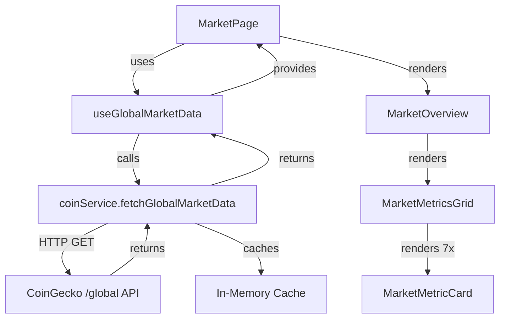
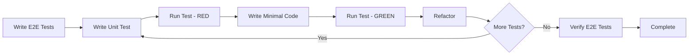

# STORY-018: Market Overview Dashboard

## Related Requirement
- [REQ-011-market-intel](../requirements/REQ-011-market-intel.md)

## Related Backlog Item
- [18] Market Overview Dashboard

## Description
As a crypto investor, I want to see a comprehensive market overview dashboard showing global crypto metrics, so that I can understand the overall market context before making portfolio decisions.

## User Value
- **Context for decisions:** Understand if portfolio gains/losses are due to individual choices or market-wide movements
- **Market awareness:** Stay informed about total market cap, volume, and dominance trends
- **Daily engagement:** Create a habit of checking market conditions before trading

## Acceptance Criteria

### Display Requirements
- [x] **AC1:** Dashboard displays total crypto market cap in USD
- [x] **AC2:** Dashboard displays 24h total trading volume in USD
- [x] **AC3:** Dashboard displays BTC dominance percentage
- [x] **AC4:** Dashboard displays ETH dominance percentage
- [x] **AC5:** Dashboard displays market cap change (24h) with percentage and color coding (green/red)
- [x] **AC6:** Dashboard displays active cryptocurrencies count
- [x] **AC7:** Dashboard displays active markets count

### Data Refresh
- [x] **AC8:** Market data refreshes automatically every 10 minutes
- [x] **AC9:** User can manually refresh data with a refresh button
- [x] **AC10:** Last updated timestamp is displayed
- [x] **AC11:** Loading state is shown during data fetch

### UI/UX
- [x] **AC12:** Dashboard is accessible from main navigation (new "Market" tab)
- [x] **AC13:** Layout is responsive on mobile and desktop
- [x] **AC14:** Numbers are formatted with appropriate units (K, M, B, T)
- [x] **AC15:** Percentage changes show up/down arrows and color coding
- [x] **AC16:** Error state is shown if API fails, with retry option

### Performance
- [x] **AC17:** Data is cached for 10 minutes to minimize API calls
- [x] **AC18:** Dashboard loads in under 2 seconds on initial visit
- [x] **AC19:** Subsequent visits load from cache instantly

## Planning
- **Estimate:** 5 Story Points
- **Priority:** High (Phase 1)
- **Sprint:** TBD
- **Dependencies:** None

---

## Preliminary Design

### Requirements Analysis

#### Story Review
The story requirements are well-defined with clear acceptance criteria covering:
- ✅ **Display Requirements (AC1-AC7):** All essential global market metrics are specified
- ✅ **Data Refresh (AC8-AC11):** Auto-refresh, manual refresh, and loading states are covered
- ✅ **UI/UX (AC12-AC16):** Navigation, responsiveness, formatting, and error handling
- ✅ **Performance (AC17-AC19):** Caching strategy is clearly defined

#### Suggested Modifications
> [!IMPORTANT]
> **Navigation Approach:** AC12 specifies a new "Market" tab in main navigation. Consider whether this should be:
> - **Option A:** A new top-level route `/market` with its own page (as currently specified)
> - **Option B:** A dashboard widget on the portfolio page
> - **Recommendation:** Proceed with Option A (separate page) to maintain clear separation of concerns and allow future expansion of market intelligence features

> [!NOTE]
> **Additional Consideration:** Consider adding AC20 for "First-time load experience" - showing a skeleton/shimmer state instead of just a spinner for better perceived performance.

---

### Architectural Design

#### Integration with Existing Architecture

**Alignment with Current Patterns:**
1. **Service Layer:** Extend existing `coinService.ts` pattern
   - Current: `fetchTopCoins()`, `fetchAssetHistory()`
   - New: `fetchGlobalMarketData()`
   - Maintains consistent API key handling and error patterns

2. **Hook Pattern:** Follow `useCoinList.ts` and `usePriceMap.ts` patterns
   - Custom hook with loading/error states
   - Built-in caching logic
   - Polling capability (reuse `usePolling.ts` if applicable)

3. **Component Structure:** Mirror existing component organization
   - Page component in `/pages`
   - Feature components in `/components/MarketOverview/`
   - Reusable UI components (cards, spinners, error banners)

#### Proposed Component Hierarchy

```
/frontend/src
├── pages/
│   └── MarketPage.tsx                    [NEW] - Route handler, orchestrates data + UI
├── components/
│   └── MarketOverview/
│       ├── index.tsx                     [NEW] - Main container component
│       ├── MarketMetricCard.tsx          [NEW] - Reusable metric display card
│       ├── MarketMetricsGrid.tsx         [NEW] - Grid layout for metric cards
│       └── DominanceIndicator.tsx        [NEW] - BTC/ETH dominance visualization
├── hooks/
│   └── useGlobalMarketData.ts            [NEW] - Data fetching + caching hook
├── services/
│   └── coinService.ts                    [EXTEND] - Add fetchGlobalMarketData()
└── utils/
    └── formatters.ts                     [EXTEND] - Add formatLargeNumber(), formatPercentage()
```

#### Data Flow Architecture



#### Caching Strategy

**In-Memory Cache (Module-Level)**
```typescript
// In coinService.ts
const CACHE_DURATION = 10 * 60 * 1000; // 10 minutes
let globalMarketCache: { data: GlobalMarketData; timestamp: number } | null = null;

const isCacheValid = () => {
  return globalMarketCache && (Date.now() - globalMarketCache.timestamp) < CACHE_DURATION;
};
```

**Rationale:**
- ✅ Simple implementation, no external dependencies
- ✅ Consistent with current architecture (no state management library)
- ✅ Automatically cleared on page refresh
- ✅ Shared across all hook instances
- ⚠️ Not persisted (acceptable for frequently-changing market data)

---

### UX Design

#### Information Hierarchy

**Primary Metrics (Large, Prominent)**
1. Total Market Cap (with 24h change)
2. 24h Trading Volume

**Secondary Metrics (Medium, Grid Layout)**
3. BTC Dominance
4. ETH Dominance
5. Active Cryptocurrencies
6. Active Markets

**Tertiary Information (Small, Subtle)**
- Last updated timestamp
- Refresh button

#### Visual Design Alignment

**Following Existing Style Guide:**

| Element | Design Token | Tailwind Classes |
|---------|-------------|------------------|
| **Page Header** | Brand gradient | `bg-brand-gradient text-white` |
| **Metric Cards** | Elevated cards | `bg-white rounded-lg shadow-md p-6` |
| **Primary Values** | Brand primary | `text-brand-primary text-3xl font-bold` |
| **Change Indicators** | Success/Error | `text-green-600` / `text-red-600` |
| **Refresh Button** | Branded CTA | `bg-brand-primary text-white hover:bg-purple-700` |
| **Loading State** | Brand spinner | `border-brand-primary` |

#### Responsive Layout

**Desktop (≥1024px):**
```
+----------------------------------------------------------+
| 🌐 Market Overview                    [🔄 Refresh]       |
+----------------------------------------------------------+
| [Total Market Cap]     [24h Volume]                      |
| $2.5T (+2.3%)          $120B                             |
+----------------------------------------------------------+
| [BTC Dom] [ETH Dom] [Active Coins] [Active Markets]     |
| 45.2%     18.7%      12,345         45,678               |
+----------------------------------------------------------+
| Last updated: 2 minutes ago                              |
+----------------------------------------------------------+
```

**Mobile (<768px):**
```
+---------------------------+
| 🌐 Market Overview        |
| [🔄 Refresh]              |
+---------------------------+
| [Total Market Cap]        |
| $2.5T                     |
| +2.3% (24h)               |
+---------------------------+
| [24h Volume]              |
| $120B                     |
+---------------------------+
| [BTC Dominance]           |
| 45.2%                     |
+---------------------------+
| [ETH Dominance]           |
| 18.7%                     |
+---------------------------+
| [Active Cryptocurrencies] |
| 12,345                    |
+---------------------------+
| [Active Markets]          |
| 45,678                    |
+---------------------------+
| Last updated: 2 min ago   |
+---------------------------+
```

#### Navigation Integration

**Update App.tsx Routes:**
```typescript
<Route path="/market" element={<MarketPage />} />
```

**Add Navigation Link:**
- Location: Main navigation (alongside Portfolio, About)
- Label: "Market" or "Market Overview"
- Icon: 🌐 or chart icon
- Active state: Highlighted when on `/market` route

#### Number Formatting Examples

| Value | Formatted | Logic |
|-------|-----------|-------|
| 2,500,000,000,000 | $2.50T | ≥ 1e12 → Trillions |
| 120,000,000,000 | $120.00B | ≥ 1e9 → Billions |
| 45,200,000 | $45.20M | ≥ 1e6 → Millions |
| 12,345 | 12,345 | < 1e6 → Comma-separated |
| 45.234% | 45.23% | Percentage with 2 decimals |

#### Color Coding for Changes

```typescript
const getChangeColor = (change: number) => {
  if (change > 0) return 'text-green-600';
  if (change < 0) return 'text-red-600';
  return 'text-gray-500';
};

const getChangeIcon = (change: number) => {
  if (change > 0) return '↑';
  if (change < 0) return '↓';
  return '→';
};
```

---

### Technical Considerations

#### API Integration

**Endpoint:** `GET https://api.coingecko.com/api/v3/global`

**Response Mapping:**
```typescript
interface GlobalMarketData {
  totalMarketCap: number;           // data.total_market_cap.usd
  totalVolume24h: number;           // data.total_volume.usd
  btcDominance: number;             // data.market_cap_percentage.btc
  ethDominance: number;             // data.market_cap_percentage.eth
  marketCapChange24h: number;       // data.market_cap_change_percentage_24h_usd
  activeCryptocurrencies: number;   // data.active_cryptocurrencies
  markets: number;                  // data.markets
  updatedAt: number;                // data.updated_at
}
```

**Error Handling:**
- Network errors: Show error banner with retry button
- API rate limiting: Use cached data, show warning
- Invalid response: Log error, show user-friendly message
- Timeout: 10-second timeout, then show error

#### Performance Optimization

**Initial Load:**
- Target: < 2 seconds (AC18)
- Strategy: Parallel data fetch with portfolio data
- Skeleton UI during first load

**Subsequent Visits:**
- Target: Instant (AC19)
- Strategy: Serve from cache if < 10 minutes old
- Background refresh if cache is stale

**Auto-Refresh:**
- Interval: 10 minutes (AC8)
- Only when tab is visible (`document.visibilityState === 'visible'`)
- Pause when tab is hidden to save resources

#### Accessibility

**ARIA Labels:**
```typescript
<button aria-label="Refresh market data">🔄</button>
<div role="status" aria-live="polite">Last updated: {timestamp}</div>
<div role="alert" aria-live="assertive">{errorMessage}</div>
```

**Keyboard Navigation:**
- Refresh button: Focusable, activatable with Enter/Space
- All interactive elements: Visible focus ring
- Tab order: Logical top-to-bottom, left-to-right

**Screen Reader Support:**
- Metric cards: Proper heading hierarchy (h2 for card titles)
- Values: Announced with context ("Total market cap: 2.5 trillion dollars")
- Changes: Announced with direction ("up 2.3 percent")

#### Testing Strategy

**Unit Tests:**
- `coinService.fetchGlobalMarketData()` - API calls, error handling, caching
- `useGlobalMarketData` - Hook state management, auto-refresh
- `formatLargeNumber()`, `formatPercentage()` - Number formatting utilities
- `MarketMetricCard` - Rendering with different props

**Integration Tests:**
- `MarketOverview` - Full component tree rendering
- Cache invalidation and refresh flows
- Error state recovery

**E2E Tests:**
- Navigate to `/market` from main navigation
- Verify all metrics are displayed
- Test manual refresh button
- Verify auto-refresh after 10 minutes (mocked timer)
- Test error state and retry functionality
- Verify responsive layout on mobile viewport

#### Potential Risks & Mitigations

| Risk | Impact | Mitigation |
|------|--------|------------|
| **API Rate Limiting** | High | 10-minute cache, respect rate limits, show cached data with warning |
| **Large Numbers Formatting** | Medium | Comprehensive unit tests, edge case handling (0, negative, very large) |
| **Auto-Refresh Memory Leak** | Medium | Proper cleanup in useEffect, clear interval on unmount |
| **Stale Data Display** | Low | Show "Last updated" timestamp, visual indicator for stale data |
| **Mobile Layout Overflow** | Low | Responsive design testing, truncate very long numbers |

---

### Open Questions for Review

1. **Navigation Placement:** Should "Market" be in the main header navigation, or should it be a separate section in a sidebar/menu?

2. **Default View:** Should the market overview be the landing page for authenticated users, or remain a separate destination?

3. **Future Expansion:** Should we design the layout to accommodate additional market intelligence features (trending coins, top movers) in the same page, or keep them separate?

4. **Dominance Visualization:** Should BTC/ETH dominance be shown as:
   - Simple percentage numbers (simpler, faster)
   - Visual progress bars (more engaging)
   - Pie chart (most visual, but more complex)

5. **Refresh Feedback:** When auto-refresh occurs, should we:
   - Show a subtle toast notification
   - Briefly highlight updated values
   - Update silently (current spec)

---

## Architecture

### Component Structure
```
/src
├── pages/
│   └── MarketPage.tsx (new)
├── components/
│   ├── MarketOverview/
│   │   ├── index.tsx (new)
│   │   ├── MarketMetricCard.tsx (new)
│   │   └── DominanceChart.tsx (new - optional)
├── hooks/
│   └── useGlobalMarketData.ts (new)
├── services/
│   └── coingeckoApi.ts (extend existing)
└── types/
    └── market.ts (new)
```

### Data Flow
```
MarketPage → useGlobalMarketData → CoinGecko API (/global)
           ↓
       MarketOverview component
           ↓
       MarketMetricCard (×6-7 cards)
```

### API Integration
**Endpoint:** `GET /global`

**Response Structure:**
```typescript
{
  data: {
    total_market_cap: { usd: number },
    total_volume_24h: { usd: number },
    market_cap_percentage: { btc: number, eth: number },
    market_cap_change_percentage_24h_usd: number,
    active_cryptocurrencies: number,
    markets: number,
    updated_at: number
  }
}
```

### State Management
- Use existing pattern: custom hook with `useState` + `useEffect`
- Cache in memory with timestamp
- No localStorage needed (market data changes frequently)

---

## TDD Workflow

This feature will be developed following **Test-Driven Development (TDD)** methodology:

### Development Sequence



### Red-Green-Refactor Cycle

1. **🔴 RED:** Write a failing test that defines desired behavior
2. **🟢 GREEN:** Write minimal code to make the test pass
3. **🔵 REFACTOR:** Improve code quality while keeping tests green

### Layer-by-Layer Approach

| Layer | Test First | Implement | Verify |
|-------|-----------|-----------|--------|
| **E2E** | Write all E2E scenarios | - | Expected to fail initially |
| **Utils** | Unit tests for formatters | Implement utilities | Tests pass |
| **Service** | Unit tests for API calls | Implement service + cache | Tests pass |
| **Hook** | Unit tests for hook logic | Implement custom hook | Tests pass |
| **Components** | Component tests | Implement UI components | Tests pass |
| **Page** | Integration tests | Implement page | Tests pass |
| **E2E** | - | - | All E2E tests now pass ✅ |

### Benefits for This Feature

- ✅ **Clear Requirements:** E2E tests document user-facing behavior
- ✅ **Confidence:** Each layer is tested before moving up
- ✅ **Regression Prevention:** Tests catch breaking changes immediately
- ✅ **Design Feedback:** Writing tests first reveals design issues early
- ✅ **Documentation:** Tests serve as living documentation

---

## Task Breakdown (TDD Approach)

> [!NOTE]
> **Development Methodology:** Following Test-Driven Development (TDD)
> - Start with E2E tests to define user-facing behavior
> - Write unit tests before implementing each function/component
> - Implement code to make tests pass
> - Refactor while keeping tests green

### 1. E2E Test Foundation (1 SP)
- [x] **T1.1:** Create E2E test spec: `market-overview.spec.ts`
- [x] **T1.2:** Write E2E test: Navigate to `/market` from main navigation
- [x] **T1.3:** Write E2E test: Verify all 7 metrics are displayed
- [x] **T1.4:** Write E2E test: Manual refresh button functionality
- [x] **T1.5:** Write E2E test: Error state and retry functionality
- [x] **T1.6:** Write E2E test: Responsive layout on mobile viewport
- [x] **T1.7:** Write E2E test: Auto-refresh after 10 minutes (mocked timer)
- [x] **T1.8:** Run E2E tests (expected to fail - no implementation yet)

### 2. Types & Utilities (0.5 SP)
- [x] **T2.1:** Write unit tests for `formatLargeNumber()` utility
- [x] **T2.2:** Implement `formatLargeNumber()` in `utils/formatters.ts`
- [x] **T2.3:** Write unit tests for `formatPercentage()` utility
- [x] **T2.4:** Implement `formatPercentage()` in `utils/formatters.ts`
- [x] **T2.5:** Create `types/market.ts` with TypeScript interfaces
- [x] **T2.6:** Verify utility tests pass

### 3. API Service Layer (1 SP)
- [x] **T3.1:** Write unit tests for `fetchGlobalMarketData()` - success case
- [x] **T3.2:** Write unit tests for `fetchGlobalMarketData()` - error handling
- [x] **T3.3:** Write unit tests for `fetchGlobalMarketData()` - caching logic
- [x] **T3.4:** Implement `fetchGlobalMarketData()` in `coinService.ts`
- [x] **T3.5:** Implement 10-minute in-memory cache
- [x] **T3.6:** Implement error handling and timeout logic
- [x] **T3.7:** Verify all API service tests pass

### 4. Custom Hook (1 SP)
- [x] **T4.1:** Write unit tests for `useGlobalMarketData` - initial load
- [x] **T4.2:** Write unit tests for `useGlobalMarketData` - loading states
- [x] **T4.3:** Write unit tests for `useGlobalMarketData` - error states
- [x] **T4.4:** Write unit tests for `useGlobalMarketData` - manual refresh
- [x] **T4.5:** Write unit tests for `useGlobalMarketData` - auto-refresh (10 min)
- [x] **T4.6:** Write unit tests for `useGlobalMarketData` - cache invalidation
- [x] **T4.7:** Implement `useGlobalMarketData` hook
- [x] **T4.8:** Verify all hook tests pass

### 5. UI Components (1.5 SP)
- [x] **T5.1:** Write component tests for `MarketMetricCard` - rendering
- [x] **T5.2:** Write component tests for `MarketMetricCard` - different states
- [x] **T5.3:** Implement `MarketMetricCard` component
- [x] **T5.4:** Write component tests for `MarketMetricsGrid` - layout
- [x] **T5.5:** Implement `MarketMetricsGrid` component
- [x] **T5.6:** Write integration tests for `MarketOverview` - full component tree
- [x] **T5.7:** Implement `MarketOverview` component (main container)
- [x] **T5.8:** Add loading skeleton states
- [x] **T5.9:** Add error state UI with retry button
- [x] **T5.10:** Style with Tailwind CSS following design system
- [x] **T5.11:** Verify all component tests pass

### 6. Page Integration & Navigation (0.5 SP)
- [x] **T6.1:** Create `MarketPage.tsx` with hook integration
- [x] **T6.2:** Add `/market` route to `App.tsx`
- [x] **T6.3:** Add navigation link to main navigation
- [x] **T6.4:** Add last updated timestamp display
- [x] **T6.5:** Add manual refresh button
- [x] **T6.6:** Verify E2E tests pass (from Task 1)

### 7. Accessibility & Polish (0.5 SP)
- [ ] **T7.1:** Add ARIA labels to all interactive elements
- [ ] **T7.2:** Add proper heading hierarchy (h1, h2)
- [ ] **T7.3:** Add screen reader announcements for updates
- [ ] **T7.4:** Test keyboard navigation (Tab, Enter, Space)
- [ ] **T7.5:** Verify focus indicators are visible
- [ ] **T7.6:** Test with screen reader (VoiceOver/NVDA)
- [ ] **T7.7:** Performance optimization (memoization if needed)

### 8. Final Verification (0.5 SP)
- [ ] **T8.1:** Run full test suite (unit + integration + E2E)
- [ ] **T8.2:** Verify all acceptance criteria met
- [ ] **T8.3:** Test responsive layout on multiple devices
- [ ] **T8.4:** Code review and refinements
- [ ] **T8.5:** Update documentation if needed
- [ ] **T8.6:** Verify Definition of Done checklist

## Technical Notes

### Caching Strategy
```typescript
const CACHE_DURATION = 10 * 60 * 1000; // 10 minutes
let cachedData: GlobalMarketData | null = null;
let cacheTimestamp: number = 0;

const isCacheValid = () => {
  return cachedData && (Date.now() - cacheTimestamp) < CACHE_DURATION;
};
```

### Number Formatting
```typescript
const formatLargeNumber = (num: number): string => {
  if (num >= 1e12) return `$${(num / 1e12).toFixed(2)}T`;
  if (num >= 1e9) return `$${(num / 1e9).toFixed(2)}B`;
  if (num >= 1e6) return `$${(num / 1e6).toFixed(2)}M`;
  if (num >= 1e3) return `$${(num / 1e3).toFixed(2)}K`;
  return `$${num.toFixed(2)}`;
};
```

### Auto-Refresh Pattern
```typescript
useEffect(() => {
  const interval = setInterval(() => {
    if (document.visibilityState === 'visible') {
      refetch();
    }
  }, 10 * 60 * 1000);
  
  return () => clearInterval(interval);
}, []);
```

## Definition of Done
- [ ] All acceptance criteria met
- [ ] All tasks completed
- [ ] Unit tests passing (>80% coverage)
- [ ] E2E tests passing
- [ ] Code reviewed and approved
- [ ] Responsive on mobile and desktop
- [ ] Accessibility verified (keyboard nav, screen readers)
- [ ] Performance verified (loads <2s)
- [ ] Documentation updated
- [ ] Merged to main branch

## Future Enhancements (Out of Scope)
- Historical market cap chart (7D, 30D trends)
- Fear & Greed Index integration
- Market sentiment indicators
- Dominance chart visualization

---

## Pull Request Description

### Summary
Implemented the Market Overview Dashboard (STORY-018) to provide users with global crypto market metrics. This feature includes a new `/market` page, real-time data fetching from CoinGecko, and a responsive UI.

### Changes
- **New Page:** `MarketPage.tsx` accessible via `/market`.
- **Components:**
  - `MarketOverview`: Main container with error handling and refresh logic.
  - `MarketMetricsGrid`: Responsive grid layout for metrics.
  - `MarketMetricCard`: Reusable card component for individual metrics.
- **Services:**
  - Added `fetchGlobalMarketData` to `coinService.ts` with 10-minute in-memory caching.
- **Hooks:**
  - Created `useGlobalMarketData` for state management and auto-refresh.
- **Utilities:**
  - Added `formatLargeNumber`, `formatPercentage`, and `formatDateTime` to `formatters.ts`.
- **Navigation:**
  - Updated `PortfolioHeader` to include navigation links for "Portfolio" and "Market".
- **Tests:**
  - Added E2E tests in `market-overview.spec.ts`.
  - Added unit tests for service, hook, and components.

### Verification
- **Automated Tests:** All unit and E2E tests passed.
- **Manual Verification:** Verified page load, data display, refresh functionality, and mobile layout in browser.

