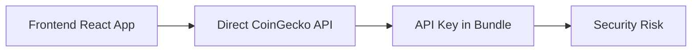
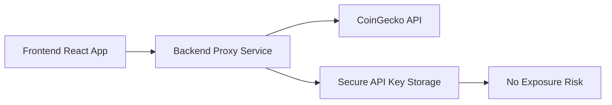

# STORY-INFRA-01: Implement NX Monorepo with Backend Proxy Service

**User Story:** As a **Product Owner**, I want to **migrate the application to an NX monorepo architecture with a secure backend proxy service** so that **we can eliminate API key security vulnerabilities while establishing a scalable foundation for future development**.

---

## 📋 Story Details

- **ID:** INFRA-01
- **Priority:** High
- **Feature Category:** Infrastructure & Security
- **Status:** 🔄 Pending
- **Related Requirement:** [REQ-026-security-backend](../requirements/REQ-026-security-backend.md)
- **Implementation Plan:** [NX Integration Plan](../architecture/nx-integration-plan.md)
- **Quick Start Guide:** [NX Quick Start](../architecture/nx-quick-start-guide.md)

---

## 🎯 Acceptance Criteria

### AC-1: NX Workspace Setup
- [ ] Initialize NX workspace with proper configuration
- [ ] Migrate existing frontend to `apps/frontend` within NX
- [ ] All 520 unit tests pass after migration
- [ ] All 166 E2E tests pass after migration
- [ ] Frontend builds and runs successfully in NX environment

### AC-2: Backend Proxy Service
- [ ] Create `apps/backend-proxy` with Express.js
- [ ] Implement CoinGecko API proxy routes
- [ ] Store API key securely in backend environment variables
- [ ] Add server-side rate limiting (50 req/min)
- [ ] Implement request/response logging
- [ ] Add health check endpoint

### AC-3: Shared Libraries
- [ ] Create `libs/shared-types` with common TypeScript types
- [ ] Create `libs/api-client` for frontend API communication
- [ ] Create `libs/utils` for shared utility functions
- [ ] Frontend updated to use proxy client instead of direct API calls
- [ ] Type safety maintained across frontend/backend

### AC-4: CI/CD Integration
- [ ] Update GitHub Actions workflow for NX
- [ ] Implement affected commands for optimized builds
- [ ] Configure parallel test execution
- [ ] Add backend service deployment
- [ ] All tests pass in CI/CD pipeline

### AC-5: Security Requirements
- [ ] API key never exposed in client bundle
- [ ] Zero API key instances in production build
- [ ] CORS properly configured with origin whitelist
- [ ] Rate limiting enforced at server level
- [ ] Security audit passes

### AC-6: Performance Requirements
- [ ] API response time <500ms (p95)
- [ ] CI build time <5 minutes
- [ ] Frontend bundle size increase <20KB
- [ ] Cache hit rate >70%
- [ ] Zero production incidents during migration

---

## 👥 User Personas

### Primary: Product Owner
- **Goal:** Eliminate security vulnerabilities while enabling scalable development
- **Pain Point:** API key exposure in frontend bundle creates security risk
- **Success Metric:** Zero API key exposure with maintained functionality

### Secondary: Development Team
- **Goal:** Improved developer experience with monorepo tooling
- **Pain Point:** Managing separate frontend/backend configurations
- **Success Metric:** Faster builds and shared tooling

### Tertiary: Security Team
- **Goal:** Secure API key management
- **Pain Point:** Frontend API key exposure
- **Success Metric:** Server-side key storage with proper access controls

---

## 🔄 Workflow

### Before (Current State)


### After (Target State)


---

## 📊 Success Metrics

| Metric | Target | Measurement Method |
|--------|--------|-------------------|
| **API Key Exposure** | 0 instances | Manual bundle inspection |
| **Test Coverage** | 100% passing | CI/CD pipeline |
| **Build Time** | <5 minutes | NX build analytics |
| **API Response Time** | <500ms (p95) | Backend monitoring |
| **Bundle Size Impact** | <20KB increase | Webpack bundle analyzer |
| **Production Incidents** | 0 critical bugs | Incident tracking |
| **Developer Velocity** | Maintained or improved | Sprint velocity tracking |

---

## 🏗️ Technical Architecture

### Monorepo Structure
```
crypture/
├── apps/
│   ├── frontend/           # React + Vite (migrated)
│   └── backend-proxy/      # Node.js/Express (new)
├── libs/
│   ├── shared-types/       # Common TypeScript types
│   ├── api-client/         # Frontend API client
│   └── utils/              # Shared utilities
└── nx.json                 # NX workspace config
```

### Technology Stack
- **Frontend:** React 19.1.0, TypeScript 5.8.3, Vite 6.3.5
- **Backend:** Node.js 24, Express.js 4.x, TypeScript 5.8.3
- **Monorepo:** NX 17.x with distributed caching
- **Testing:** Vitest (unit), Playwright (E2E), Jest (backend)
- **CI/CD:** GitHub Actions with NX Cloud integration

---

## 🚀 Implementation Phases

### Phase 1: NX Setup & Frontend Migration (Week 1)
- Initialize NX workspace
- Migrate frontend to `apps/frontend`
- Update import paths and configurations
- Validate all tests passing

### Phase 2: Backend Service Implementation (Week 2)
- Create backend proxy service
- Implement CoinGecko API routes
- Add rate limiting and logging
- Create shared libraries

### Phase 3: CI/CD & Production Deployment (Week 3)
- Update GitHub Actions workflow
- Deploy backend to production
- Update frontend environment
- Monitor and optimize

---

## ⚠️ Risks & Mitigations

| Risk | Impact | Probability | Mitigation |
|------|--------|-------------|------------|
| **NX learning curve** | Medium | Medium | Team training, documentation |
| **Build configuration issues** | High | Low | Thorough dev testing, rollback plan |
| **Import path breakage** | High | Medium | Automated migration, comprehensive tests |
| **Backend deployment issues** | High | Low | Staging environment, gradual rollout |
| **Performance degradation** | Medium | Low | Performance benchmarking, caching |

---

## 📝 Definition of Done

- [ ] All acceptance criteria met
- [ ] Code review completed by Lead Developer
- [ ] Security audit passed
- [ ] Performance benchmarks met
- [ ] Documentation updated
- [ ] Production deployment successful
- [ ] Post-deployment monitoring active
- [ ] Team training completed

---

## 🔗 Dependencies

### Technical Dependencies
- **REQ-026-security-backend** - Security backend requirements
- **Existing frontend tests** - Must all pass after migration
- **CoinGecko API** - External dependency for proxy implementation

### Team Dependencies
- **Lead Developer (Nati)** - Technical review and approval
- **DevOps** - Production deployment support
- **QA Team** - Testing and validation

---

## 📅 Timeline

| Week | Activities | Owner | Status |
|------|------------|-------|--------|
| 1 | NX setup & frontend migration | Dev Team | 🔄 Pending |
| 2 | Backend service implementation | Dev Team | 🔄 Pending |
| 3 | CI/CD integration & deployment | DevOps | 🔄 Pending |

**Total Duration:** 3 weeks (15 working days)

---

## 🎯 Business Value

### Security Benefits
- **Eliminates API key exposure** - Critical security vulnerability resolved
- **Server-side rate limiting** - Prevents API abuse and cost overruns
- **Secure key management** - Proper environment variable storage

### Development Benefits
- **Scalable architecture** - Foundation for future microservices
- **Improved developer experience** - NX tooling and shared libraries
- **Faster CI/CD** - Distributed caching and affected commands
- **Type safety** - Shared TypeScript types across projects

### Operational Benefits
- **Better monitoring** - Centralized logging and error tracking
- **Easier deployment** - Separate frontend/backend deployments
- **Cost optimization** - Efficient build caching reduces CI costs

---

## 📚 Related Documents

- [NX Integration Plan](../architecture/nx-integration-plan.md) - Comprehensive implementation plan
- [NX Quick Start Guide](../architecture/nx-quick-start-guide.md) - Step-by-step setup
- [Technical Meeting #1 MOM](../meetings/technical-meeting-1.md) - Meeting notes and decisions
- [REQ-025 Security Phase 1](../requirements/REQ-025-security-phase1.md) - Security requirements
- [Product Backlog](../master-plan/Phase%201%20-%20Business%20Analysis%20and%20Backlog%20Refinement/inputs/product-backlog.md) - Backlog item

---

## 🔄 Version History

| Version | Date | Changes | Author |
|---------|------|---------|--------|
| 1.0 | 16/01/2026 | Initial story creation | Product Owner |
| | | | |

---

**Story Status:** 🔄 Ready for Implementation  
**Last Updated:** 16/01/2026  
**Product Owner:** Product Owner  
**Technical Lead:** Nati (Lead Developer)  
**Implementation Story:** [Story Documentation](../backlog-items/backlog-item-INFRA-01/story-1/story.md)
